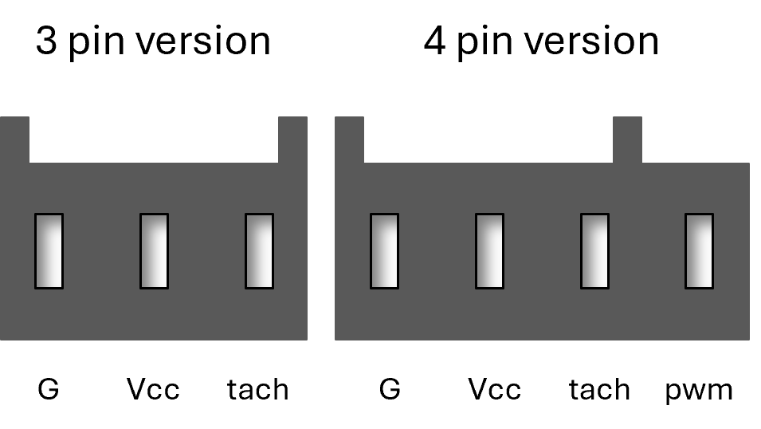

# Zephyr-Whispers, the ball game
This ball game is a puzzle game made out of tubes, fans, small balls and distance sensors. You need to get the ball through the maze by walking around the structure.
**Initial idea**
An immersive circular installation where lightweight fabric panels sway and dance in response to visitors’ movements, creating a mesmerizing play of colors and gentle breezes
Inspired by
- [Morning Mist](https://www.designlabexperience.com/projects/morning-mist-fans-installation)
- [Daniel Wurtzel's Air Series](https://www.danielwurtzel.com/)
- [Hans Haakcke's Blue Sail](https://arth207-spring.tumblr.com/post/50658432895)

## Description
- Barrier posts are set-up in a circular patterns of about 1m diameter
- Each barrier post is equiped with distance sensor, oriented outward
- In the middle of the circle, a patterns of tubes is installed
- These tubes are filles with small styrofoam balls in different colors
- Underneath built-in at difference places in the tubes, air vents are installed that trigger when people come close to the distance sensors
- This creates a mesmerizing puzzle

## Materials
- Tubes, 3 meters / 40-50mm, transparent acryl ([€10/m](https://www.kunststofforte.nl/product/transparante-acrylaat-buizen-xt/)) > €30
- 6 x Arduino Unos ([6 x €25](https://www.kiwi-electronics.com/nl/arduino-uno-rev3-atmega328-729?search=arduino)) > €150
- 6 x small fans (brushless DC, 5V, 0.5A) ([6 x €10](https://www.mouser.be/ProductDetail/Delta-Electronics/EFB0405VHD-F00?qs=%2FW4LtXOBxKsYebwOUVkrBw%3D%3D)) > €60
- 6 x HC-SR04 Ultrasonic distance sensor ([6 x €5,5](https://www.kiwi-electronics.com/nl/ultrasoon-sensor-hc-sr04-2592?search=HC-SR04%20Ultrasonic%20distance%20sensor)) > €33
- Duct tape
- 6 x neopixel strip ([6 x €7](https://www.kiwi-electronics.com/nl/neopixel-stick-8x-5050-rgb-led-met-geintegreerde-drivers-7316)) > €42
- 6 x LN298N motor driver ([6 x €4](https://www.kiwi-electronics.com/nl/dual-h-bridge-dc-stepper-motor-driver-l298n-4117?search=LN298N)) > €24
- 6 x DC to Terminal connector ([6 x €2](https://www.kiwi-electronics.com/nl/terminal-block-naar-2-1mm-dc-barrel-jack-female-747?search=Terminal%20connector)) > €12
- 6 x 5V adapter ([6 x €10](https://www.kiwi-electronics.com/nl/terminal-block-naar-2-1mm-dc-barrel-jack-female-747?search=Terminal%20connector)) > €60
- Paint
- Base plate

## Sensor set-up  
Components:
- 6 x HC-SR04 Ultrasonic distance sensor
- 6 x Arduino Uno & wires
- LN298N motor driver
- 6x Power supply
- Casing

The Arduino detects the distance and maps this to a PWM signal that drives the motor.   
- Connect the distance sensor to the Arduino (Vcc > 5V, Gnd > GND, Trigg > digital 2, Echo > digital 3)
- Connect the motor driver to the Arduino
- Connect the fan to the motor driver
- Upload this script to the Arduino
- Connect the power to the motor driver
  
**air flow set-up**
  
- In this iteration we're working with RGB PC fans
  - These come with a pin for the fan
    - 
    - Takes 5-12V
    - Tachiometer can read the speed
    - PWM can control the speed (max speed if unconnected)
  - And pins for the RGB
- Tubes
- 3D printed air vent covers
- Mounting hardware (screws, nuts, bolts)
- Power supply

**Optional: Lights**
- TBD
